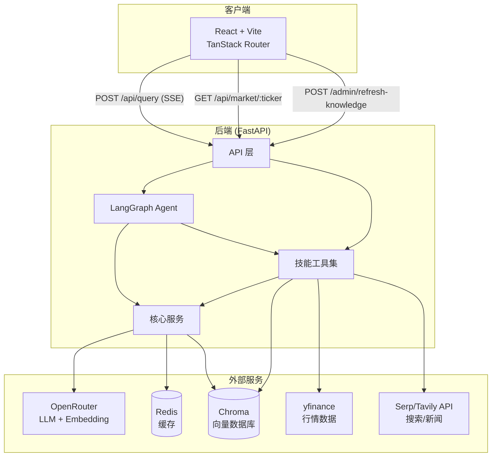
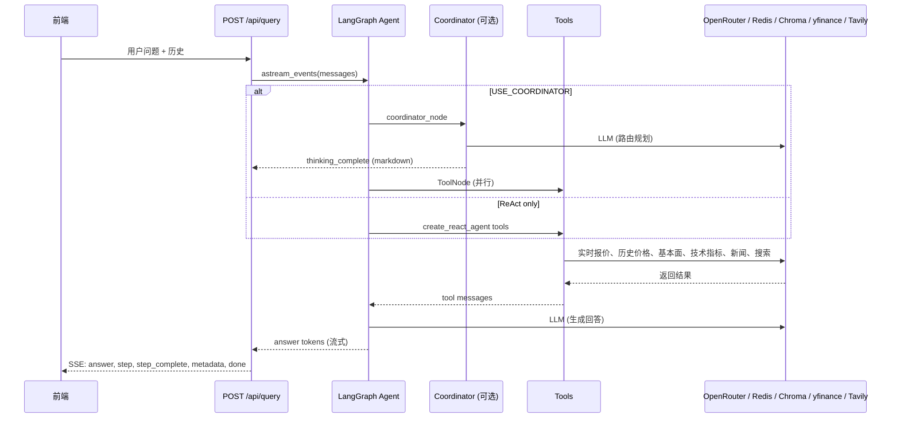

# Finance QA System

基于 LangGraph + RAG 的智能金融问答系统，支持实时行情、基本面分析、技术指标、新闻资讯、知识库检索和网络搜索。

## 快速开始

**环境要求：** Python 3.12+、Node.js 18+ (推荐 Bun)、Docker、Redis

```bash
git clone <repository-url>
cd FinanceQA
cp .env.example .env   # 设置 OPENAI_API_KEY 或 OPENROUTER_API_KEY；可选：TAVILY_API_KEY、NEWS_API_KEY
```

**Docker 部署（推荐）**

```bash
docker-compose up -d
# 前端 http://localhost:5173  后端 http://localhost:8000  API文档 http://localhost:8000/docs
```

**本地开发**

```bash
# 后端
cd backend && uv sync && uv run uvicorn main:app --reload --host 0.0.0.0 --port 8000

# 前端
cd frontend && bun install && bun run dev
```

## 功能特性

- **实时行情**：股票实时报价、历史价格数据
- **基本面分析**：公司财务指标、盈利能力、估值水平、股息信息
- **技术指标**：MA、EMA、RSI、MACD、Stochastic、ATR 等常用技术指标及信号
- **新闻资讯**：金融新闻检索，支持时间范围筛选
- **知识库**：可配置的向量知识库，支持网页、Wikipedia、Yahoo Finance、本地文件、Tavily 搜索
- **网络搜索**：Tavily 实时网络搜索，补充最新信息
- **智能 Agent**：支持 Coordinator 模式（强制工具调用减少幻觉）和 ReAct 模式

## 项目结构

```
FinanceQA/
├── backend/                     # Python FastAPI 后端
│   ├── api/                    # FastAPI 路由
│   │   └── routes/             # API 端点
│   │       ├── query.py        # 问答接口 (SSE 流式)
│   │       ├── market.py       # 行情数据接口
│   │       └── admin.py        # 管理接口
│   ├── config/                 # 配置文件
│   │   ├── settings.py         # 应用配置
│   │   └── knowledge_sources.json  # 知识源配置
│   ├── core/agent/             # LangGraph Agent 核心
│   │   ├── graph.py            # Agent 图定义
│   │   ├── graph_with_coordinator.py  # Coordinator 模式
│   │   ├── coordinator.py       # 协调器
│   │   └── state.py            # 状态管理
│   ├── services/                # 核心服务
│   │   ├── llm_client.py       # LLM 客户端 (OpenRouter)
│   │   ├── embedding.py        # 向量嵌入
│   │   ├── cache_service.py    # Redis 缓存
│   │   ├── knowledge_manager.py # 知识库管理
│   │   └── fetchers/           # 数据获取器
│   │       ├── web_page.py    # 网页抓取
│   │       ├── wikipedia.py   # Wikipedia
│   │       ├── yahoo_finance.py # Yahoo Finance
│   │       ├── tavily.py       # Tavily 搜索
│   │       └── local_file.py   # 本地文件
│   ├── skills/                 # Agent 工具技能
│   │   ├── market_data/        # 行情数据
│   │   ├── fundamentals/       # 基本面分析
│   │   ├── technical_analysis/  # 技术指标
│   │   ├── news/               # 新闻资讯
│   │   └── research/           # 知识库检索
│   ├── prompts/                # Prompt 模板
│   ├── scripts/                 # 辅助脚本
│   └── main.py                 # 应用入口
├── frontend/                    # React + Vite 前端
│   └── src/
│       ├── routes/             # 页面路由
│       ├── components/         # 组件
│       ├── hooks/             # 自定义 Hooks
│       └── services/           # 前端服务
├── docs/                       # 文档
│   └── architecture.md         # 架构文档
└── docker-compose.yml          # Docker 编排
```

## 系统架构图

### 整体架构



### 请求处理流程



## 技术选型说明

### 后端技术栈

| 类别 | 技术选型 | 说明 |
|------|----------|------|
| **Web 框架** | FastAPI | 高性能异步 API 框架，支持自动生成文档 |
| **Agent 框架** | LangGraph | 基于图结构的 LLM Agent 编排，支持状态持久化 |
| **LLM 路由** | OpenRouter | 统一接口访问多种 LLM (Claude, GPT 等) |
| **向量数据库** | Chroma | 轻量级向量数据库，支持本地持久化 |
| **缓存** | Redis | 行情、新闻、embedding 结果缓存 |
| **数据获取** | yfinance | Yahoo Finance 行情数据 |
| **搜索** | Tavily | 专业金融/新闻搜索 API |
| ** Embedding** | text-embedding-3-small | OpenAI 向量嵌入模型 |
| **重排序** | BGE-reranker-v2-m3 | 本地 ONNX 推理的 reranker 模型 |

### 前端技术栈

| 类别 | 技术选型 | 说明 |
|------|----------|------|
| **框架** | React + Vite | 现代前端构建工具 |
| **路由** | TanStack Router + Bun | 类型安全的客户端路由，开发足够快，成熟团队推荐Next.js |
| **HTTP** | 原生 Fetch + SSE | Server-Sent Events 流式响应 |
| **图表** | rechart | K 线图和指标可视化 |

### 架构设计原则

1. **模块化技能系统**：每个技能（market_data, fundamentals, technical_analysis, news, research）独立实现，通过 LangGraph 工具机制注册
2. **可配置的知识库**：通过 `knowledge_sources.json` 灵活配置数据源，支持网页、Wikipedia、Yahoo Finance、Tavily、本地文件
3. **智能 Agent 模式**：支持 Coordinator 模式（强制工具调用规划，减少幻觉）和纯 ReAct 模式
4. **缓存策略**：多级缓存（Redis + 内存），按数据类型设置不同 TTL
5. **异步处理**：全链路异步设计，提高并发处理能力

## Prompt 设计思路

系统采用 **工具驱动 + Agent 编排** 的架构，Prompt 设计围绕以下核心目标：

### 1. 模式选择：Coordinator vs ReAct

| 维度 | Coordinator 模式 | ReAct 模式 |
|------|------------------|------------|
| **执行流程** | LLM 规划 → 并行工具调用 → LLM 总结 | LLM 逐步推理 + 工具调用交替 |
| **幻觉控制** | 强制工具调用，未规划的工具不可用 | 依赖 LLM 自觉调用工具 |
| **时间窗口** | 统一规划，全局共享 | 各工具独立处理 |
| **适用场景** | 复杂问题、多工具协同 | 简单问答、调试开发 |

**设计决策**：默认启用 Coordinator 模式，通过 `USE_COORDINATOR` 配置切换。Coordinator 先输出结构化 JSON 计划，确保工具调用的可控性和可解释性。

### 2. 时间范围处理

金融分析通常涉及时间维度，Prompt 设计采用**统一时间窗口**策略：

- **自动推断**：根据问题措辞（近期/短期/中期/长期）自动推断时间范围
- **全局共享**：`analysis_start` / `analysis_end` 通过 LangGraph State 在工具间传递
- **工具绑定**：技术指标必须绑定价格工具，避免单独调用

### 3. 减少幻觉的设计

- **强制工具调用**：Coordinator 模式下，必须通过工具获取数据，Prompt 明确禁止直接回答
- **工具绑定约束**：技术分析工具必须与价格工具配合，防止空指标
- **知识库优先**：概念性问题优先检索 RAG，补充网络搜索，确保信息来源可靠
- **数据来源声明**：要求回答必须声明数据来源，增强可信度

### 4. 响应语言一致性

- **自动检测**：Coordinator 输出 `response_language` 字段
- **LLM 遵循**：生成回答时严格使用用户输入的语言
- **金融术语保留**：英文缩写（PE、EPS、ROE 等）保持原样

### 5. 错误处理与容错

- **工具错误透明**：工具返回错误时，Prompt 要求明确告知用户并提供建议
- **优雅降级**：部分工具失败时，仍使用可用工具生成回答
- **免责声明**：技术指标必须包含"仅供参考，不构成投资建议"

### 6. 状态管理

- **State 注入**：使用 LangGraph 的 `InjectedState` 在工具间共享分析时间窗口
- **上下文保持**：对话历史通过消息列表传递，支持多轮追问

## 数据来源

### 实时行情数据

- **数据源**：Yahoo Finance (yfinance)
- **数据类型**：实时报价、历史 OHLCV、52 周高低
- **延迟**：约 15 分钟
- **缓存 TTL**：60 秒（实时报价）、3600 秒（历史数据）

### 基本面数据

- **数据源**：Yahoo Finance
- **数据类型**：
  - 估值指标：市值、PE、PB、PEG、EV/Revenue、EV/EBITDA
  - 盈利能力：利润率、ROE、ROA、毛利率
  - 每股指标：EPS、Book Value、Revenue/Share
  - 财务健康：现金、负债、负债/权益、流动比率
  - 增长指标：Revenue Growth、Earnings Growth
  - 股息：股息率、派息率
- **缓存 TTL**：86400 秒（1 天）

### 技术指标

- **计算库**：pandas_ta
- **支持的指标**：
  - 移动平均：SMA、EMA（动态周期）
  - 动量指标：RSI、Stochastic
  - 趋势指标：MACD
  - 波动性指标：ATR
- **信号生成**：基于指标阈值生成多空信号
- **缓存 TTL**：3600 秒

### 新闻数据

- **数据源**：SerpAPI (Google News) + Tavily
- **功能**：
  - 时间范围筛选
  - 内容提取验证
  - 多源合并去重
- **缓存 TTL**：1800 秒

### 知识库

支持多种数据源配置（`backend/config/knowledge_sources.json`）：

| 数据源类型 | Fetcher | 说明 |
|------------|---------|------|
| **Web 网页** | WebPageFetcher | 抓取指定 URL 的金融知识文章 |
| **Wikipedia** | WikipediaFetcher | 搜索金融概念术语 |
| **Yahoo Finance** | YahooFinanceFetcher | 抓取股票基本面数据 |
| **Tavily** | TavilyFetcher | 实时搜索最新财报/新闻 |
| **本地文件** | LocalFileFetcher | 支持 txt/md/docx/pdf |

**知识库刷新**：
- 自动调度：每天凌晨 2 点（可配置）+ 周一额外刷新
- 手动刷新：`POST /admin/refresh-knowledge`

### 向量检索

- **Embedding 模型**：text-embedding-3-small (OpenAI)
- **向量数据库**：Chroma
- **Chunk 配置**：默认 2000 字符，重叠 400 字符
- **重排序**：BGE-reranker-v2-m3 (本地 ONNX 推理)

## 常用命令

| 用途 | 命令 |
|------|------|
| 后端开发/测试 | `cd backend && uv run uvicorn main:app --reload` |
| 运行测试 | `cd backend && uv run pytest` |
| 代码格式化 | `cd backend && uv run ruff format .` |
| 代码检查 | `cd backend && uv run ruff check .` |
| 刷新知识库 | `cd backend && uv run python scripts/refresh_knowledge.py --run-now` |
| 测试数据获取器 | `cd backend && uv run python scripts/test_fetchers.py` |
| 下载 reranker 模型 | `cd backend && uv run --with optimum --with torch python scripts/download_reranker.py` |
| 前端开发 | `cd frontend && bun run dev` |
| 前端构建 | `cd frontend && bun run build` |
| Docker 部署 | `docker-compose up -d` |
| 查看日志 | `docker-compose logs -f` |
| 停止服务 | `docker-compose down` |

## 配置说明

### 环境变量

创建 `.env` 文件：

```bash
# 必需
OPENAI_API_KEY=sk-...        # 或使用 OPENROUTER_API_KEY

# 可选
TAVILY_API_KEY=...          # 搜索和新闻
NEWS_API_KEY=...            # SerpAPI (Google News)
REDIS_URL=redis://localhost:6379

# 知识库
KNOWLEDGE_FILES_DIR=./knowledge  # 本地文件目录

# 模型配置
DEFAULT_MODEL=anthropic/claude-3.5-sonnet
ROUTER_MODEL=openai/gpt-4o-mini
RAG_MODEL=openai/gpt-4o-mini

# Agent 模式
USE_COORDINATOR=true        # 是否使用 Coordinator 模式
```

### 知识库配置

编辑 `backend/config/knowledge_sources.json`：

```json
{
  "sources": [
    {
      "name": "static_web_pages",
      "type": "web",
      "enabled": true,
      "fetcher": "WebPageFetcher",
      "config": {
        "urls": ["https://..."]
      }
    },
    {
      "name": "wikipedia_articles",
      "type": "wiki",
      "enabled": true,
      "fetcher": "WikipediaFetcher",
      "config": {
        "queries": ["市盈率", "P/E ratio"]
      }
    }
  ],
  "chunking": {
    "chunk_size": 2000,
    "chunk_overlap": 400
  }
}
```

## 故障排除

- **后端启动失败**：检查 Python 3.12+、`.env` 配置、Redis (`docker-compose ps redis`)
- **知识库为空**：检查 `knowledge_sources.json`，运行 `test_fetchers.py`，然后 `refresh_knowledge.py --run-now`
- **前端无法连接后端**：`curl http://localhost:8000/health`，检查 CORS 和浏览器控制台

## 优化与扩展思考

### 1. 对话与记忆增强

- **多轮对话**：深化上下文理解，优化追问场景的上下文保持
- **记忆系统**：长期记忆用户偏好和分析历史，支持个性化
- **反思机制**：结果验证和自我纠错，提升回答可靠性

### 2. 数据源扩展

- **更多市场**：扩展支持港股、A 股、ETF、期货等更多市场
- **替代数据**：添加分析师评级、机构持仓、期权数据
- **实时推送**：WebSocket 推送实时行情（当前为轮询）

### 3. 检索增强

- **动态分块**：根据内容类型自适应分块策略
- **多语言支持**：中英文知识库分别索引

### 4. 前端增强

- **K 线交互**：支持缩放、平移、技术指标叠加
- **图表库**：集成 TradingView Advanced Charts

### 5. 可观测性

- **链路追踪**：集成 LangSmith 或 Jaeger 追踪请求
- **性能监控**：响应时间、Token 消耗统计
- **错误告警**：异常情况告警通知

## 相关文档

- [架构文档](docs/architecture.md) — 详细的前后端架构和请求流程图
- [开发计划](development-plan-v2.2.md) — 版本规划和待办事项

## 技术参考

- [LangGraph](https://langchain-ai.github.io/langgraph/) — Agent 编排框架
- [FastAPI](https://fastapi.tiangolo.com/) — Python Web 框架
- [Chroma](https://docs.trychroma.com/) — 向量数据库
- [uv](https://docs.astral.sh/uv/) — Python 包管理

---

MIT License. Issues and PRs welcome.
