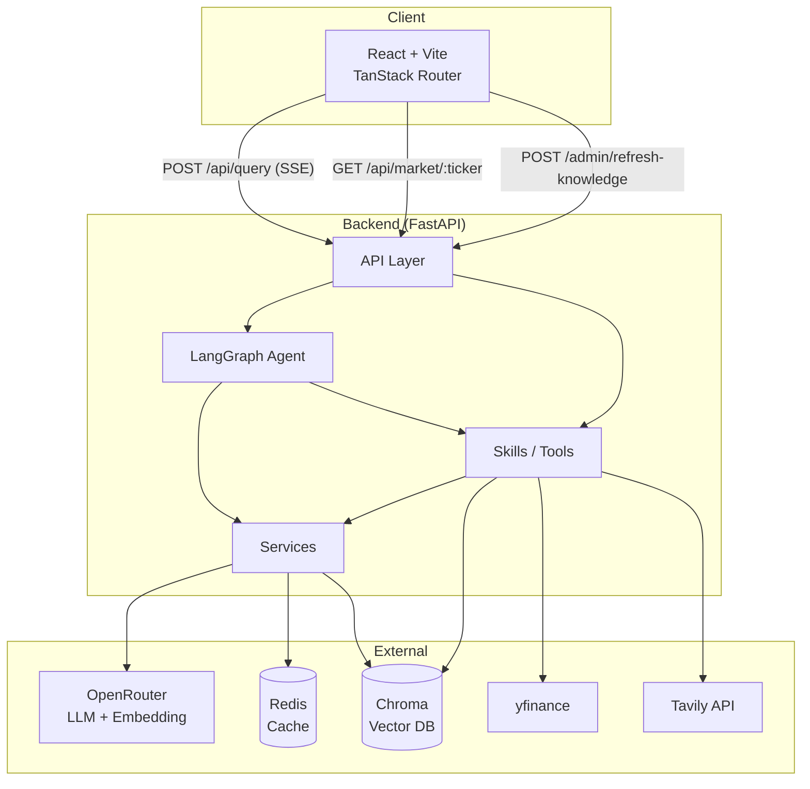
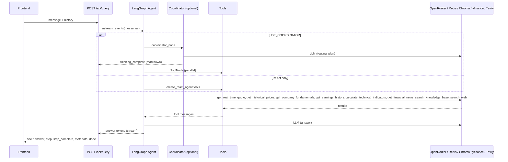
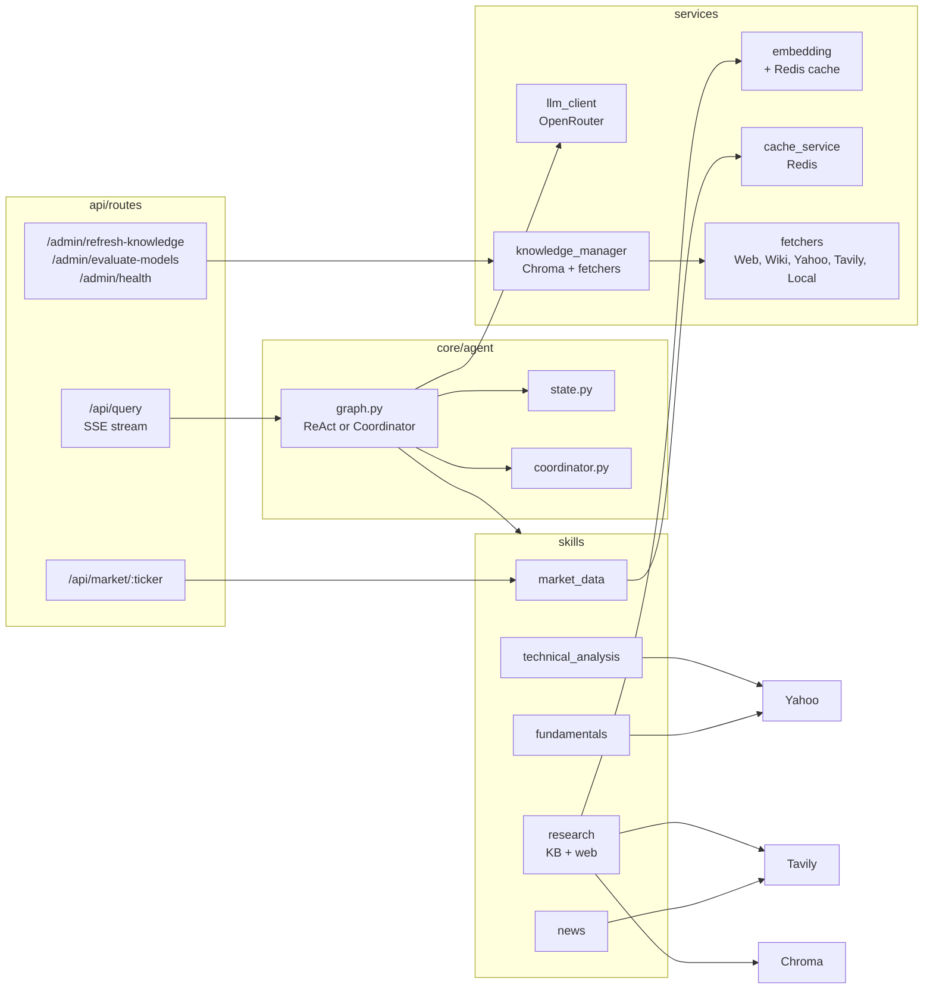

# Finance QA — Architecture

## High-level: Frontend ↔ Backend ↔ External

## Request flow: Query (SSE)

## Backend components

## Data & scheduler

- **Knowledge base refresh**: APScheduler (lifespan) runs daily (+ Monday extra); config in `backend/config/knowledge_sources.json`. Fetchers → embed → Chroma.
- **Redis**: Cache for market data, news, embeddings (when available; fail-open if Redis down).
- **Chroma**: Vector store for RAG; used by `search_knowledge_base` and by `knowledge_manager` when refreshing.
